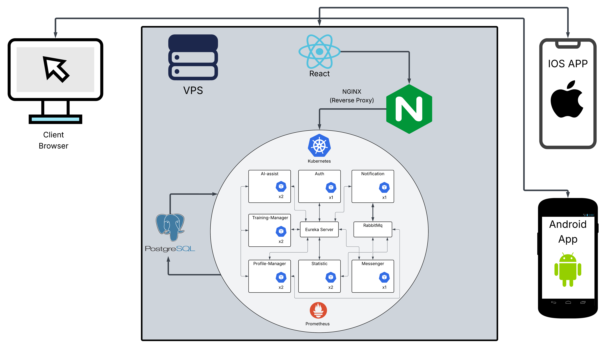

# 🏋️‍♂️ TrainifyHub – Kompleksowa platforma fitness

TrainifyHub to nowoczesna aplikacja do współpracy trenerów personalnych z podopiecznymi. Umożliwia tworzenie, kupowanie i zarządzanie planami treningowymi. Projekt oparty jest na architekturze mikroserwisów uruchomionych w Kubernetes, z rozdzielonym frontendem i aplikacjami mobilnymi.

	

  
	 
  

  <b>Kompleksowa platforma fitness dla trenerów i ich podopiecznych.</b> 
  Twórz plany, komunikuj się w czasie rzeczywistym i rozwijaj swoją formę z pomocą AI. 

---

## 📌 Spis treści

- [Opis projektu](#opis-projektu)
- [Stack technologiczny](#stack-technologiczny)
- [Architektura systemu](#architektura-systemu)
- [Moduły backendowe](#moduły-backendowe)
- [Frontend](#frontend)
- [Aplikacje mobilne](#aplikacje-mobilne)
- [Funkcjonalności](#funkcjonalności)
- [Uruchomienie lokalne](#uruchomienie-lokalne)

---

## 🧠 Opis projektu

Celem aplikacji jest zapewnienie nowoczesnego narzędzia dla trenerów i ich klientów. Trener może tworzyć i przypisywać spersonalizowane plany treningowe z gotowych ćwiczeń (z animacjami 3D), a użytkownik może z nich korzystać w przystępnej formie na każdym urządzeniu.
Dla użytkowników jest też możliwość kupna gotowych planów treningowych oraz wygenerowanie planu przez AI
---

## 🛠️ Stack technologiczny

**Backend:**
- Java 17
- Spring Boot + Spring Cloud
- Mikroserwisy (7 aplikacji + Eureka Server)
- RabbitMQ – komunikacja asynchroniczna
- WebSocket – komunikacja w czasie rzeczywistym (czat, powiadomienia)
- PostgreSQL
- Kubernetes (orchestracja kontenerów)
- Docker
- NGINX – reverse proxy

**Frontend:**
- React.js
- MUI (Material UI)
- i18next – wersje językowe (PL/EN/DE)

**Mobile:**
- Android: TWA (Trusted Web Activity – pełny dostęp do PWA w Google Play z obsługą powiadomień oraz zakupami w aplikacji)
- iOS: WebView – opakowanie strony jako aplikacja natywna z obsługą powiadomień oraz zakupami w aplikacji

---

## ⚙️ Architektura systemu

- ✅ NGINX – reverse proxy do obsługi żądań HTTPS
- ✅ Eureka Server: rejestracja i odnajdywanie serwisów
- ✅ RabbitMQ: eventy między serwisami (Powiadomienia)
- ✅ WebSocket – komunikacja w czasie rzeczywistym dla czatu i powiadomień
- ✅ Kubernetes – zarządzanie wdrożeniami i skalowaniem aplikacji

---

### 🗺️ Schemat architektury

---

## 🧩 Moduły backendowe

| Nazwa modułu         | Opis                                                                 |
|----------------------|----------------------------------------------------------------------|
| `auth`               | Obsługa logowania, rejestracji, JWT , płatności                      |
| `messenger`          | Komunikacja użytkownik ↔ trener  Chat                                |
| `training-manager`   | Zarządzanie planami treningowymi oraz ćwiczeniami                    |
| `statistic`          | Zbieranie i przekazywanie statystyk                                  |
| `notification`       | Zbieranie i wysyłanie powiadomień do Aplikacji mobilnych i frontendu |
| `profile-manager`    | Zarządzanie profilami oraz obsługuje upload zdjec profilowych i wideo|                                          |
| `aiAssist`           | Generowanie planów AI na podstawie preferencji                       |
| `eureka-server`      | Rejestracja mikroserwisów (Spring Cloud Netflix)                     |

---

## 🎨 Frontend (React)

- Responsywny interfejs (Mobile / Desktop)
- Animacje scrollowania, efekt 3D (model telefonu z dynamicznymi opisami)
- Integracja z backendem przez REST API
- Obsługa wielu języków (i18n)
- logowanie przez Google oraz Apple
---

## 📱 Aplikacje mobilne

**Android (TWA):**
- Bezpośrednie wdrożenie PWA do Google Play
- Natywne działanie i pełna integracja z systemem wraz z powiadomieniami oraz płatnościami

**iOS (WebView):**
- Opakowana strona jako aplikacja iOS
- Implementacja powiadomien oraz płatności
- Natywne logowanie przez Apple
- Implementacja Facebook SDK do kampani reklamowych

---

## 🚀 Funkcjonalności

- 🧠 Tworzenie planów AI na podstawie celu, doświadczenia i sprzętu
- 🏋️ Kupowanie spersonalizowanych planów od trenerów
- 📝 Tworzenie i edytowanie planów własnych
- 📤 Przypisywanie planów podopiecznym
- 📱 Dostęp do planu z każdego urządzenia
- 🏋️ Kupowanie gotowych planów
- 💬 Chat z trenerem
- 📊 Statystyki postępów
- 🎥 Animacje 3D ponad 800 ćwiczeń
- 🌍 Wersje językowe (PL, EN, DE)

---

## ⚙️ Uruchomienie lokalne

⚠️ Uwaga:
Pełne uruchomienie systemu lokalnie nie jest możliwe bez dostępu do prywatnych kluczy, które nie są dołączone do repozytorium ze względów bezpieczeństwa.

Dotyczy to m.in.:
	•	Kluczy Google / Apple (logowanie, płatności, powiadomienia)
	•	Poświadczeń Firebase / GCP
	•	Kluczy API zewnętrznych integracji
	•	Sekretów baz danych i konfiguracji produkcyjnej

Repozytorium zawiera jedynie bezpieczny kod źródłowy bez danych wrażliwych.
Jeśli chcesz zapoznać się z działaniem aplikacji – Skontaktuj się .
